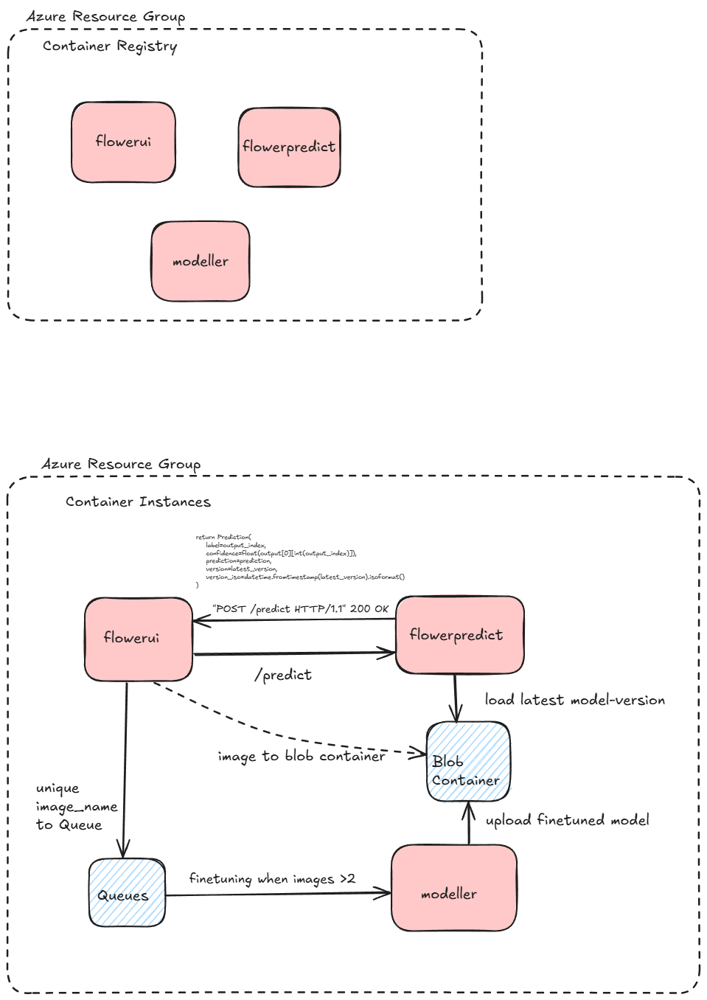

## Flower Prediction Website
## Online Learning

Tavoitteena on luoda kukkadatalle tunnistusta tekevä nettisivu Azuren pilvipalveluun.

Arkkitehtuurikuva Azuren  (kuvasta poiketen uudelleen koulutus käynnistyy kun kuvia on yli 5 kappaletta jonossa):



Azure CLI ja terraform tarvitaan!

````
az login  #kirjautuminen azureen terminaalissa

az account show #tilin tiedot
````

## Käyttö dockerissa 

**docker-compose.yml** 
Luo kontit:
* azurite  (emuloi Azure Blob Storagea ja Azure Queue Storagea paikallisessa ympäristössä.)
* populate  (lisää mallin ja data Blob Storageen)
* front  (streamlit käyttöliittymä localhost:8000)
* back   (ennustusta tekevä backend, fastapi dokumentaatio localhost:8888/docs)
* modeller (uudelleenkouluttaa mallin kun kuvia on tarpeeksi jonossa)


````
docker compose up -d
docker ps
docker compose logs -f
````

**Käyttöliittymä löytyy osoitteesta localhost:8000** 


## Terraformin avulla palveluiden pystytys Azureen

<details>
<summary>Valmistelut</summary>


# Valmistelut

Tarvitset tässäseuraavat asiat:

* [Git](https://git-scm.com/downloads) asennettuna
* [Visual Studio Code](https://code.visualstudio.com/) asennettuna
* [Terraform](https://www.terraform.io/downloads.html) asennettuna
* [Azure CLI](https://docs.microsoft.com/en-us/cli/azure/install-azure-cli) asennettuna
* [Azure-tili](https://azure.microsoft.com/en-us/free/) ja [Azure-tilauksen](https://azure.microsoft.com/en-us/free/) luotuna
* [HashiCorp Terraform](https://marketplace.visualstudio.com/items?itemName=HashiCorp.terraform) -lisäosa Visual Studio Codeen

Asenna paketit (terraform ja azure cli) käyttäen paketinhallintaa.

## Mikä on paketinhallinta?

Paketinhallintaan on useita vaihtoehtoja:

* Windows:
    * [Scoop](https://scoop.sh/)
    * [Chocolate](https://chocolatey.org/)
    * Winget (Windows Package Manager, built-in)
* MacOS:
    * [Homebrew](https://brew.sh/)
    * [MacPorts](https://www.macports.org/)

Linuxilla kullakin distribuutiolla on oma paketinhallintansa ja lisäksi löytyy distribuutiovapaita kuten Snap.

## Vaihe 1: Scoop

Käytä esim. Scoopia, joka on Windowsille tarkoitettu paketinhallinta.

Asenna Scoop Powershell-komennoilla, jotka löytyvät sivustolta [scoop.sh](https://scoop.sh/):

```powershell
Set-ExecutionPolicy -ExecutionPolicy RemoteSigned -Scope CurrentUser
Invoke-RestMethod -Uri https://get.scoop.sh | Invoke-Expression
```


## Vaihe 2: Terraform

Voit sulkea PowerShellin ja siirtyä sinulle tutumpaan shelliin kuten **Git Bash**, mikäli haluat.

Asenna Terraform Scoopilla:

```bash
scoop install terraform
```


## Vaihe 3: Azure CLI

Asenna Azure CLI Scoopilla:

```bash
scoop install azure-cli
```

## Vaihe 4: Kirjaudu Azureen

Navigoi selaimella osoitteeseen [https://portal.azure.com](https://portal.azure.com) ja kirjaudu Azureen.


## Vaihe 5: Kirjaudu Azure CLI:llä

Kirjaudu Azureen komennolla:

```bash
az login
```

Tästä aukeaa selainikkuna, jossa kirjaudut Azureen. Kirjaudu sisään ja palaa takaisin shelliin.

Voit tarkistaa kirjautumisen komennolla:

```bash
az account show
```

</details>

1. Container Registryn pystytys: 

````
cd infta/tf/container_registry
terraform init
terraform apply
````

**tf/container_registry**
* luo Azure recource groupin ja azure container registryn
    * rg-emma-olearn-acr
    * cremmaolearn
        * = "cr${var.identifier}${var.course_short_name}"


2. Imaget konttirekisteriin:
````
cd scripts/
./01_acr_login.sh # kirjaudu konttirekisteriin
./02_build_n_release.sh flowerui 1.0  #vie image ja versio
./02_build_n_release.sh flowerpredict 1.0
./02_build_n_release.sh modeller 1.0
````

3. Palveluiden pystytys Azureen

````
cd infra/tf/services
terraform init
terraform apply
````

**cd infra/tf/services/main.tf**
* luo azure recourge group (resurssiryhmä)
    * rg-emma-olearn
* luo storage account (Azure Storage tili)
    * saemmaolearn
* luo storage container (Säiliö tiedostojen tallennusta varten)
    * st-emma-olearn
* luo storage queue  (Viestijono)
    * sq-emma-olearn
* luo storage containeriin blobit tallennettavia tiedostoja varten (data ja mallit) (tallentaa tiedot säiliöön)
    * st-emma-olearn -> "kansiot" models ja datasets
* luo azure container group (konttiryhmä, `docker pull` komennot otettu konttirekisterin imageista)
    * ci-emma-olearn

## Azure Blob Storage
*Azure Blob Storage on Microsoft Azure -pilvipalvelun tarjoama skaalautuva, kustannustehokas ja turvallinen palvelu, joka on suunniteltu erityisesti suurten tietomäärien tallentamiseen ja hallintaan. "Blob" on lyhenne sanoista Binary Large Object, ja se viittaa suuriin tiedostoihin tai binääritietoihin, kuten asiakirjoihin, kuviin, videoihin tai varmuuskopioihin.* 