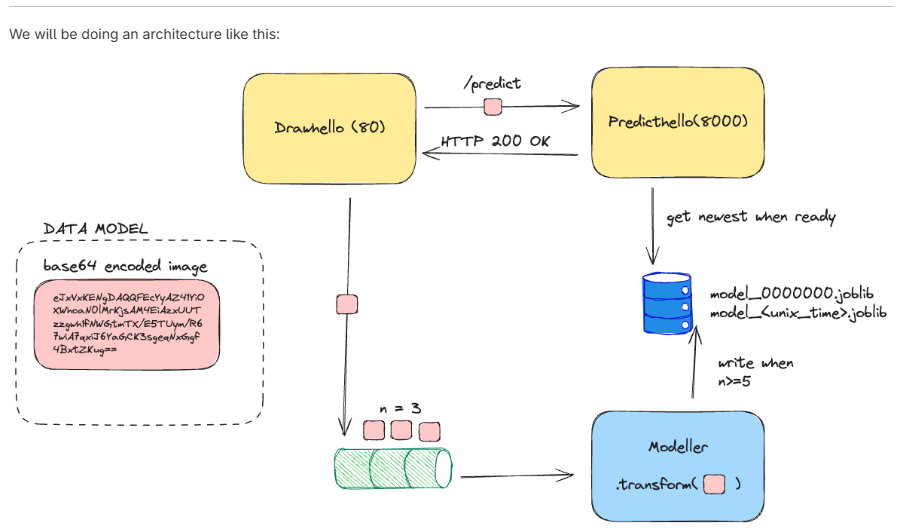
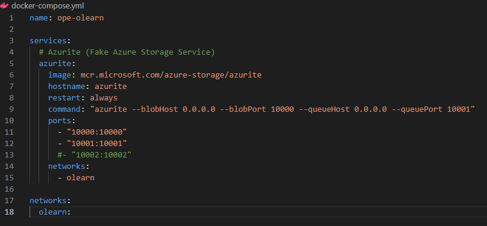
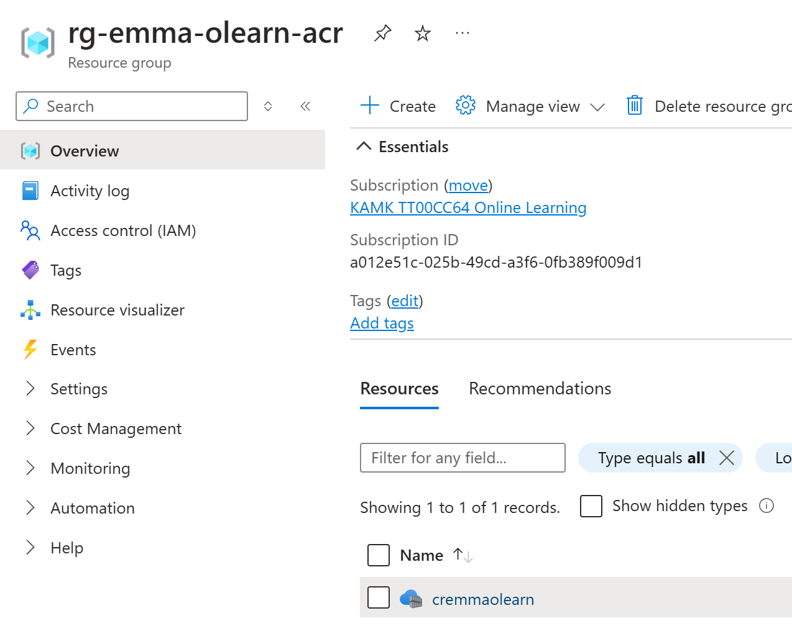
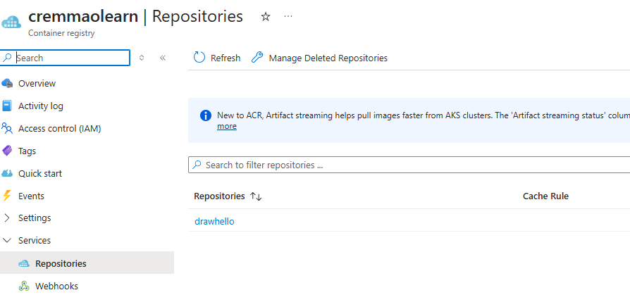

## Tehtävän toteutus
* sain toimimaan mallin populoinnin konttiin sekä front ja back konttien yhteyden
* kuvadata ei vielä liiku, eikä malli lataudu onnistuneesti
* nämä siis seuraavaksi kuntoon, kuvadatan lähetys frontista backkiin, backissa mallin lataus ja ennustuksen palautus 


## Online Learning

Tavoitteena on luoda kukkadatalle tunnistusta tekevä nettisivu Azuren pilvipalveluun



Azure CLI ja terraform tarvitaan

````
az login

az account show
````
**docker-compose.yml** -> pitää ajaa ylös ennen scripiten ajoa, koska luo kontit niitä varten!
* azurite kontti
* populate (myöhemmin)
* networks 

## Steps taken: 
**requirements.txt pitää olla**
````
azure-storage-blob
azure-storage-queue
python-dotenv
````
**Virtuaaliympäristön luominen** 
````
python3 -m venv .venv
source .venv/Scripts/activate
pip install -r requirements
````


`curl http://localhost:10000`



**.env** 

Määritellään seuraavien muuttujien arvoja:
````
USE_AZURE_CREDENTIAL
STORAGE_ACCOUNT_NAME
STORAGE_CONNECTION_STRING
STORAGE_CONTAINER
STORAGE_QUEUE
PREDICT_HELLO_URL
````

**src/azurite_tester/manual_testing.py** (vaatii samaan sijaintiin .env tiedoston, jossa piti muuttaa `STORAGE_CONNECTION_STRING` azurite -> localhost)
* tarkistaa yhteydet blobsiin ja queueen
* tarkistaa resurssit
* pistää tavaraa jonoon aikaleiman kanssa

**src/azurite_populate/populate.py** (tarvii myös Dockerfile, dataset.csv, model, requirements.txt)
* blob ja queue luonti
* tiedostojen lataus 


## Azure Blob Storage
*Azure Blob Storage on Microsoft Azure -pilvipalvelun tarjoama skaalautuva, kustannustehokas ja turvallinen palvelu, joka on suunniteltu erityisesti suurten tietomäärien tallentamiseen ja hallintaan. "Blob" on lyhenne sanoista Binary Large Object, ja se viittaa suuriin tiedostoihin tai binääritietoihin, kuten asiakirjoihin, kuviin, videoihin tai varmuuskopioihin.* 

## Drawhello kehitys

**src/drawhello**
* .env.docker¨
* app.py -> streamlit frontin koodi
* Dockerfile
* image_utils.py
* requirements
* lisätään docker composee frontille oma kontti koneen porttiin 8000 ja kontin portti 80

http://localhost:8000

docker compose up -d
docker ps
docker compose logs -f

## Terraformin alustus

 mkdir -p infra/tf/container_registry
 cd infra/tf/container_registry/
 cp ~/code/3_vuosi/online-learning-course/ope-olearn/infra/tf/container_registry/*.tf .

terraform init
terraform apply



cp ~/code/3_vuosi/online-learning-course/ope-olearn/infra/tf/services/*.tf .

**scripts**
* 01_acr_login.sh -> loggautuu Azure Container Registryyn
* 02_build_n_release.sh -> buildaa app.py Dockerfilen avulla

Luo tiedostos, tarvittaessa muuta ajettavkais chmod  
Aja ./scripts/01_acr_login.sh ja ./scripts/build_n_release.sh drawhello 1.0



cd infra/tf/services
terraform init
terraform apply

Ehkä toimii nyt kun muutin imagen osoitteen oikeaksi services/variables.tf
````
variable "frontend_image" {
  type        = string
  description = "The image to use for the frontend container (The Draw Hello Streamlit UI)."
  default     = "cremmaolearn.azurecr.io/drawhello:1.0"
}
````


### MITÄ TEIN

1. virtuaaliympäristön luominen. testailin paikallisesti emulaattorin avulla testausta, että saan mallin ja datasetin oikeaan paikkaan ja jonoon lisäyksen toimimaan (docker compose azurite ja populate, src/azurire**)
2. drawhello lisäys src:een, docker composeen lisäys ja ui:n käyttö onnistui paikallisesti
3. terraform alustus, infra/tf/container registry konttirekisterä varten, minne voi scripteillä viedä imageja src:n alta
4. palvelun luonti, oma terraform apply siellä. main ja variables osioihin niiden konttien lisäys, mitkä on scriptillä viety konttirekisteriin. 

**tf/container_registry**
* luo Azure recource groupin ja azure conatiner registryn
    * rg-emma-olearn-acr
    * cremmaolearn
               = "cr${var.identifier}${var.course_short_name}"

**tf/services**
* luo azure recourge group
    * rg-emma-olearn
* luo storage account
    * saemmaolearn
* luo storage container
    * st-emma-olearn
* luo storage queue
    * sq-emma-olearn
* luo storage containeriin blobit tiedostoja varten (data ja mallit)
    * st-emma-olearn -> "kansiot" models ja datasets
* luo azure container group
    * ci-emma-olearn
